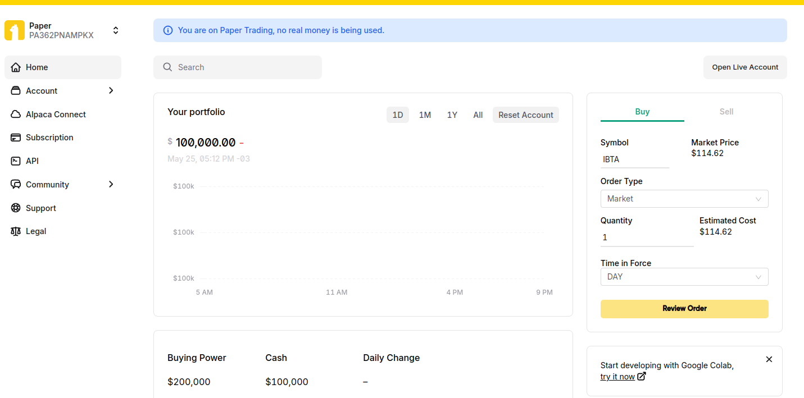

## Foundry

**Foundry is a blazing fast, portable and modular toolkit for Ethereum application development written in Rust.**

Foundry consists of:

-   **Forge**: Ethereum testing framework (like Truffle, Hardhat and DappTools).
-   **Cast**: Swiss army knife for interacting with EVM smart contracts, sending transactions and getting chain data.
-   **Anvil**: Local Ethereum node, akin to Ganache, Hardhat Network.
-   **Chisel**: Fast, utilitarian, and verbose solidity REPL.

## Documentation

https://book.getfoundry.sh/

## Usage

**Olhar os seguintes repositorios**: 
- https://github.com/ethercats/degeneratefarm/blob/main/contract.sol
- https://github.com/gelatodigital/vrf-nft/tree/main/src/vendor
- https://docs.chain.link/vrf/v2/subscription/examples/get-a-random-number

**Projetos que estoiu pegando de referencia para melhorar**
- https://tititi.gitbook.io/tititi-nft-research-labs/incentive/erc6551-incentive-program

instalar a seguinte library do ccip:

```javascript
forge install smartcontractkit/ccip@b06a3c2eecb9892ec6f76a015624413fffa1a122 --no-commit
```

```javascript
forge install https://github.com/smartcontractkit/chainlink-brownie-contracts --no-commit
```
- https://app.alpaca.markets/paper/dashboard/overview



### Build

```shell
$ forge build
```

### Test

```shell
$ forge test
```

### Format

```shell
$ forge fmt
```

### Gas Snapshots

```shell
$ forge snapshot
```

### Anvil

```shell
$ anvil
```

### Deploy

```shell
$ forge script script/Counter.s.sol:CounterScript --rpc-url <your_rpc_url> --private-key <your_private_key>
```

### Cast

```shell
$ cast <subcommand>
```

### Help

```shell
$ forge --help
$ anvil --help
$ cast --help
```
